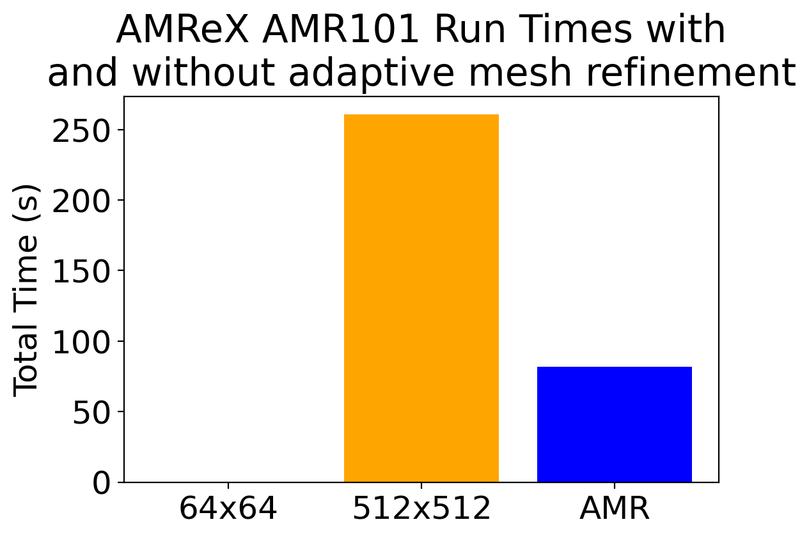
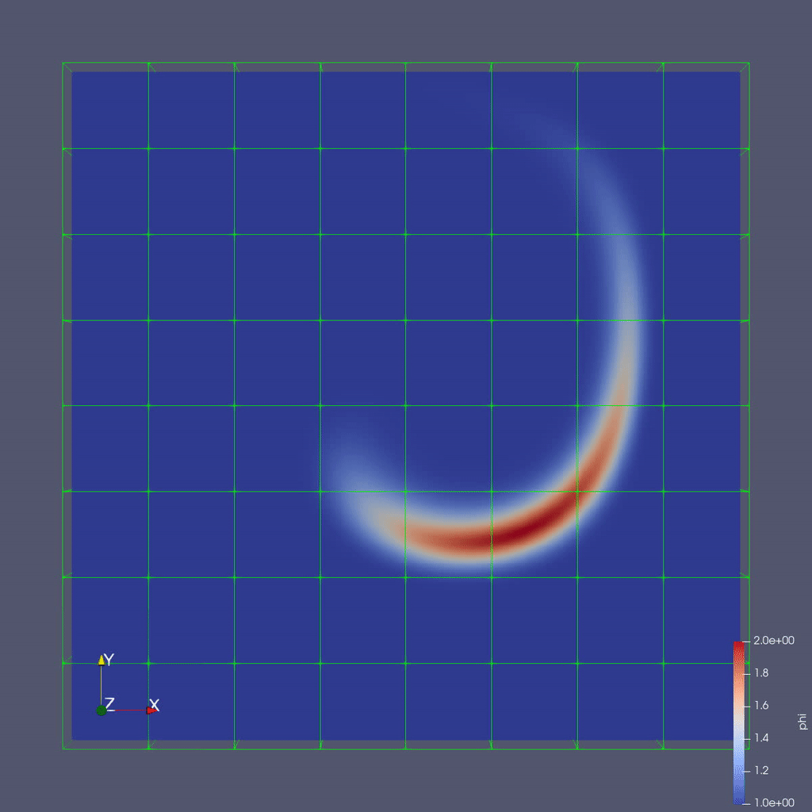
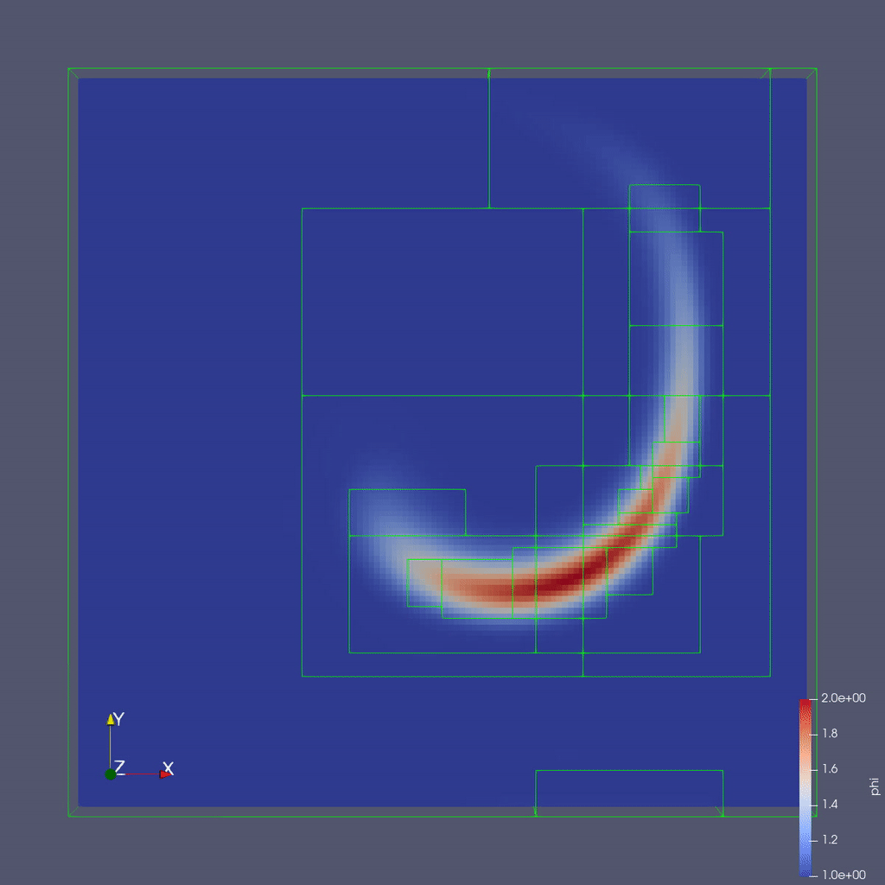
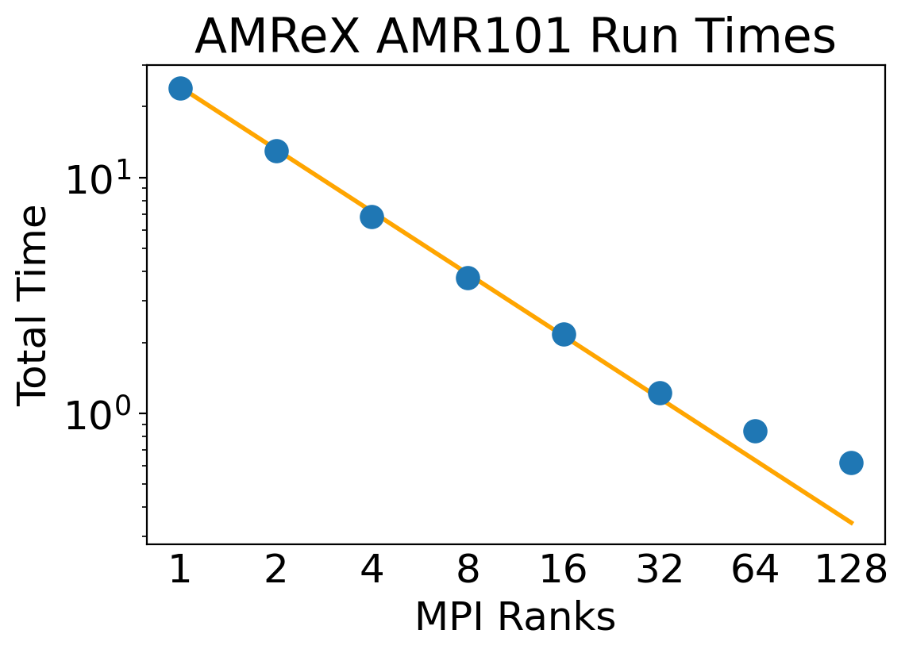
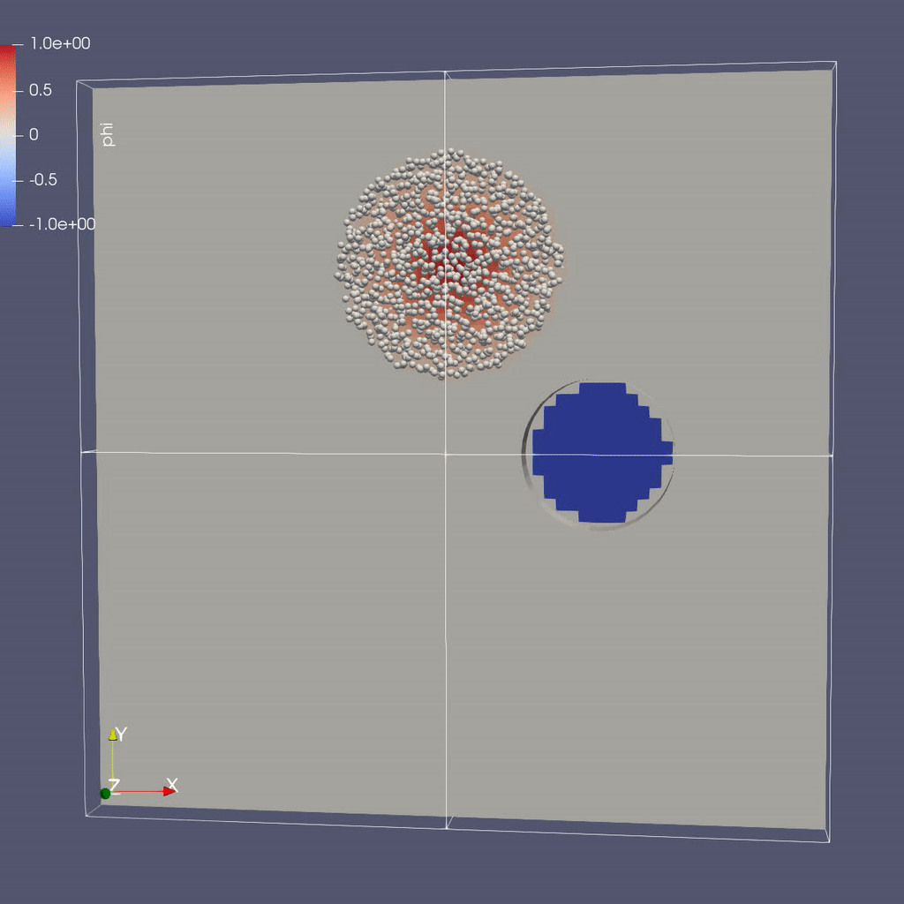
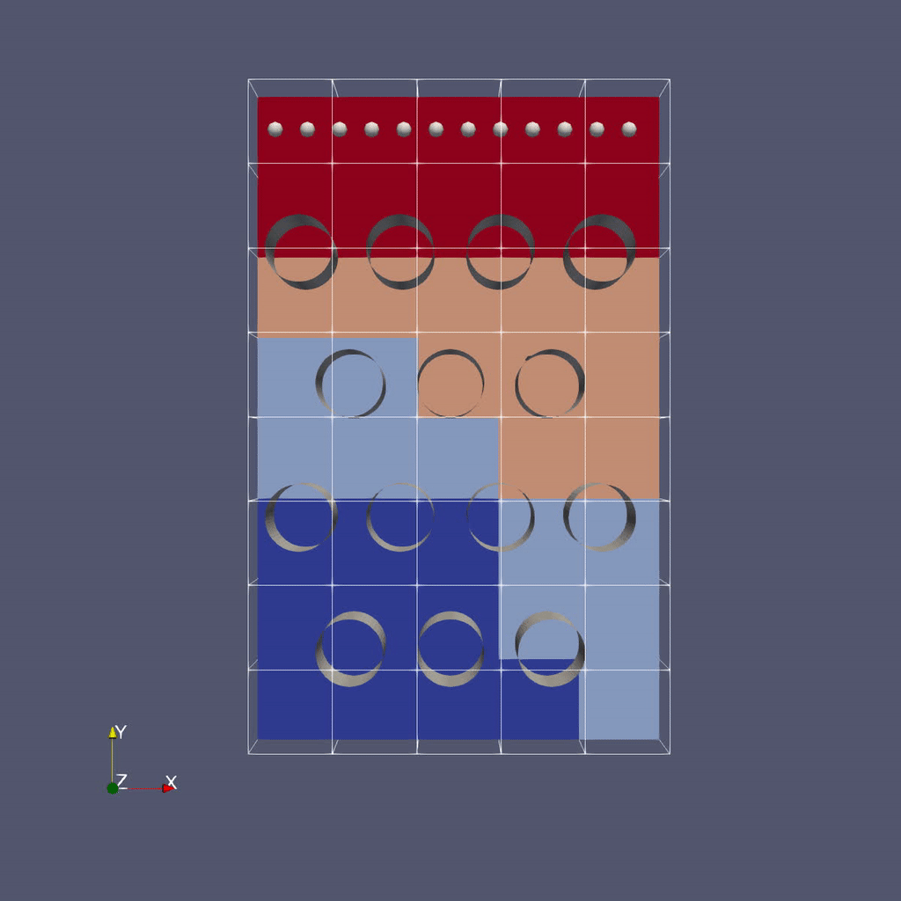

<!--
---
layout: page-fullwidth
order: 2
title: "Meshing and Discretization with AMReX"
teaser: "A Block Structured Adaptive Mesh Refinement Framework"
subheader: "Not your grandmother's AMR...!"
permalink: "lessons/amrex/"
years: [2023]
use_math: true
lesson: true
header:
 image_fullwidth: "amrex_warpx-fs8.png"
---
-->

<script
  src="https://cdn.mathjax.org/mathjax/latest/MathJax.js?config=TeX-AMS-MML_HTMLorMML"
  type="text/javascript">
</script>

<br>

{:refdef: style="text-align: center;"}

{:refdef}

## At a Glance

<!-- (Expected # minutes to complete) %% temporarily omit -->

|**Questions**|**Objectives**|**Key Points**|
|How does Adaptive Mesh Refinement (AMR) work and when would I want it?|Understand AMR applicability, benefits and trade-offs.| AMR is a flexible approach for achieving science goals.|
|How does AMReX do AMR?|Understand AMReX provides functionality as a software framework.|Simulations are coded with AMReX data structures and functions; your science is still your code.|
|Would AMReX be useful for my application?|Understand conceptual requirements and benefits of running with AMReX.|AMReX provides support for AMR, Embedded Boundaries, Particles and more on a variety of heterogeneous architectures.|


<!--
|What can I do with AMReX?|Understand that "AMR" means more<br>than just "traditional AMR"|AMR + EB + Particles|
|How do I get started?|Understand easy set-up|It's not hard to get started|
|What time-stepping do I use?|Understand the difference between subcycling and not|It's a choice|
|How do I visualize AMR results?|Use Visit and Paraview for AMReX vis|Visualization tools exist for AMR data.|
-->

## Setup Instructions For AMReX Tutorials


1. Log into the Perlmutter login node with your username (replace "elvis"):
```shell
ssh elvis@perlmutter.nersc.gov
```

2. In your scratch folder, create a local copy of the examples:
```shell
cd $PSCRATCH
rsync -a /global/cfs/cdirs/training/2024/amrex_mar2024 .
```

3. Request a single-gpu interactive job, skip the reservation option after the training ends:
```shell
salloc -q shared_interactive -A ntrain9 --reservation=amrex_mar2024 -N 1 -c 32 -t 00:45:00 -C gpu -G 1
```

4. Change to the AMReX examples directory:
```shell
cd amrex_mar2024
```

<!---
5. Load OpenMPI:
```shell
module load openmpi/openmpi-4.1.4_ucx-1.14.0_gcc-9.4.0_cuda-11.8
```
7. Setup several environment variables and path by
sourcing the `env_setup_amrex.sh` script:
```shell
source env_setup_amrex.sh
```
--->


 <!--

Vis can be finicky on Cooley because there are certain details that we need to set up first:

- Access Cooley with `ssh -X`
- Vis needs to be run inside an interactive session on a compute node

Recall, to get an interactive session, do, e.g.:

```shell
qsub -I -n 1 -t 300 -A ATPESC2021 -q training
```

- Then in the interactive session, edit your `~/.soft.cooley` file to contain only the following and then use the `resoft` command:

```shell
+mvapich2
+anaconda3-4.0.0
+ffmpeg
@default
```

- Also in the interactive session, configure the vis tools using the following command:

```shell
source /eagle/projects/ATPESC2021/EXAMPLES/track-5-numerical/amrex/source_this_file.sh
```

- When finished with these AMReX tutorials, revise your `~/.soft.cooley` following step 3 [here](https://xsdk-project.github.io/MathPackagesTraining2021/setup_instructions/) and then do `resoft` to revert these package changes for other tutorials.

|
--> 


<br>
### Science Goal
<br>

To motivate our discussion of adaptive mesh refinement we will consider the flow
of a dye in water around a cylinder. See the video below:

|{: width="500"}|
|:--:|
| https://www.youtube.com/watch?v=KiBrKzykwO8 |


We want to develop a fluid simulation that captures the behavior seen in this experiment.
To capture the interactions carefully, we plan on doing a large and detailed simulation
and will therefore be limited by computational resources and time to solution. Moreover,
we know that our focus is on the water-dye boundary, and not on the water as a whole, so
an approach with adaptive mesh refinement would provide benefits. As a first step in developing
this simulation, we consider a simplified problem, the flow of the dye without a cylinder.

<br>
<br>
<br>
## AMR101: Multi-Level Scalar Advection

---

**FEATURES:**
- Mesh Data
- Dynamic Adaptive Mesh Refinement
- Scalable Parallel Computation


<br>
### Mathematical Formulation

Let $$\phi$$ represent the concentration of dye in the water in
in a thin incompressible fluid that is spinning
clock-wise and then counter-clockwise with a prescribed motion (This is useful for verifying our algorithms).
We consider the dye to be a passive tracer that is advected by the fluid velocity and the fluid thin
enough that we can model this as two-dimensional motion.  

In other words, we want to solve for $$\phi(x,y,t)$$ by evolving

$$\frac{\partial \phi}{\partial t} + \nabla \cdot (\bf{u^{spec}} \phi)  = 0$$

in time ($$t$$), where the velocity $${\bf{u^{spec}}} = (u,v)$$ is a divergence-free field computed by defining

$$\psi(i,j) = \sin^2(\pi x) \sin^2(\pi y)  \cos (\pi t / 2) / \pi $$

and defining

$$u = -\frac{\partial \psi}{\partial y},  v = \frac{\partial \psi}{\partial x}.$$

Note that because $${\bf{u^{spec}}}$$ is defined as the curl of a scalar field, it is analytically divergence-free

In this example we'll be using AMR to resolve the scalar field since the location of the dye is
what we care most about.

### Algorithm

To update the solution in a patch at a given level, we compute fluxes ($${\bf u^{spec}} \phi$$)
on each face, and difference the fluxes to create the update to phi.   The update routine
in the code looks like

```cpp
  // Do a conservative update
  {
    phi_out(i,j,k) = phi_in(i,j,k) +
                ( AMREX_D_TERM( (flxx(i,j,k) - flxx(i+1,j,k)) * dtdx[0],
                              + (flxy(i,j,k) - flxy(i,j+1,k)) * dtdx[1],
                              + (flxz(i,j,k) - flxz(i,j,k+1)) * dtdx[2] ) );
  }
```

In this routine we use the macro `AMREX_D_TERM` so that we can write dimension-independent code;
in 3D this returns the flux differences in all three directions, but in 2D it does not include
the z-fluxes.

<br>
### Adaptive Mesh Refinement

Adaptive mesh refinement focuses computation on the areas of interest. In this example,
our interest is in the water-dye boundary and not water in other places in the domain.
Adaptive mesh refinement will allow us to set grids in this area with smaller dimensions
and/or small time steps. The result is areas with finer grids have results with higher
accuracy.

Developing a code that is capable of adaptive mesh refinement, broadly speaking,
requires:
- Knowing how to advance the solution one patch at a time.
- Knowing the matching conditions at coarse/fine interfaces.
Below we show a snippet of code in this simulation written with the AMReX framework
for generating a finer grid level from a coarser one.

```cpp
// Make a new level using provided BoxArray and DistributionMapping and
// fill with interpolated coarse level data.
// overrides the pure virtual function in AmrCore
void
AmrCoreAdv::MakeNewLevelFromCoarse (int lev, Real time, const BoxArray& ba,
                    const DistributionMapping& dm)
{
    const int ncomp = phi_new[lev-1].nComp();
    const int nghost = phi_new[lev-1].nGrow();
    
    phi_new[lev].define(ba, dm, ncomp, nghost);
    phi_old[lev].define(ba, dm, ncomp, nghost);

    t_new[lev] = time;
    t_old[lev] = time - 1.e200;

    // This clears the old MultiFab and allocates the new one
    for (int idim = 0; idim < AMREX_SPACEDIM; idim++)
    {   
    facevel[lev][idim] = MultiFab(amrex::convert(ba,IntVect::TheDimensionVector(idim)), dm, 1, 1);
    }   

    if (lev > 0 && do_reflux) {
    flux_reg[lev].reset(new FluxRegister(ba, dm, refRatio(lev-1), lev, ncomp));
    }   

    FillCoarsePatch(lev, time, phi_new[lev], 0, ncomp);
}    
```

<br>
### Running the Code

To run the code navigate to the directory with your copy of the AMReX examples.

```shell
cd $PSCRATCH/amrex_mar2024
cd AMReX_Amr101
```

In this directory you'll see:

```shell
main3d.gnu.x86-milan.MPI.ex -- the 3D executable built with MPI

main3d.gnu.MPI.CUDA.ex -- the 3D executable built with MPI and CUDA

inputs, inputs_for_scaling -- input files specifying simulation parameters
```

To run in serial:

```shell
./main3d.gnu.x86-milan.MPI.ex inputs_for_scaling
```

To run in parallel, for example on 16 ranks:

```shell
srun -n 16 -c 2 ./main3d.gnu.x86-milan.MPI.ex inputs_for_scaling
```
Note how the simulation time changes.
To run on the GPU:

```shell
srun -n 1 -c 32 --gpus-per-task=1 ./main3d.gnu.MPI.CUDA.ex inputs_for_scaling
```


<br>
#### Inputs File

The following parameters can be set at run-time -- these are currently set in the inputs
file but you can also set them on the command line.

```
stop_time          = 2.0                # the final time (if we have not exceeded number of steps)
max_step           = 100000              # the maximum number of steps (if we have not exceeded stop_time)

amr.n_cell         = 64 64 8             # number of cells at the coarsest AMR level in each coordinate direction

amr.max_grid_size  = 16                  # the maximum number of cells in any direction in a single grid

amr.plot_int       = 10                  # frequency of writing plotfiles

adv.cfl            = 0.9                 # cfl number to be used for computing the time step

adv.phierr = 1.01  1.1  1.5              # regridding criteria  at each level

```

This inputs file specifies a base grid of 64 x 64 x 8 cells, made up of 16 subgrids each with 16x16x8 cells.
Here is also where we tell the code to refine based on the magnitude of $$\phi$$. We set the
threshold level by level.  If $$\phi > 1.01$$ then we want to refine at least once; if $$\phi > 1.1$$ we
want to resolve $$\phi$$ with two levels of refinement, and if $$\phi > 1.5$$ we want even more refinement.
Boundaries are set to be periodic in all directions (Not shown above).


<br>
#### Simulation Output

Note that you can see the total runtime by looking at the line at the end of your run that says,
```
Total Time:
```

and you can check conservation of $$\phi$$ by checking the line that prints, e.g.
```
Coarse STEP 8 ends. TIME = 0.007031485953 DT = 0.0008789650903 Sum(Phi) = 540755.0014
```

"Sum(Phi)" is the sum of $$\phi$$ over all the cells at the coarsest level.


<br>
### Visualizing the Results

For convenience we created a python script powered by
[ParaView 5.11](https://gitlab.kitware.com/paraview/paraview/-/tags/v5.11.1)
to render the AMReX plotfiles. [FFmpeg](https://ffmpeg.org/) is then used to stitch the images into a movie
and gif. To generate a movie from the plotfiles type:

```
pvbatch paraview_amr101.py
```

This will generate two files, `amr101_3D.avi` and `amr101_3D.gif`.
To view the files you can copy them to your local machine and view
them with scp. Open a terminal on your local machine and move the folder where you want
to download the mp4 and gif. Then type:
```shell
scp elvis@theta.alcf.anl.gov:~/track-5-numerical/amrex/AMReX_Amr101/Exec/amr101_3D\* .
```

Escaping the wildcard with `\` is necessary on some shells.

The image below shows a slice through a 3D run with 64x64x8 cells at the coarsest level and three finer levels (4 total levels).

{: width="500"}

To plot the files manually with a local copy of ParaView see the details below:

<details>
<strong>Using ParaView 5.11.1 Manually with Downloaded Plotfiles</strong>

<p>
To do the same thing with ParaView 5.11.1 manually (if, e.g. you have the plotfiles
on your local machine and want to experiment):
</p>

<ol>
<li>Start Paraview 5.11.1</li>
<li>File --> Open ... and select the collection of directories named "plt.." --> [OK]</li>
<li>From the "Open Data With..." dialog that pops up, select "AMReX/BoxLib Grid Reader" --> [OK]</li>
<li>Check the "phi" box in the "Cell Array Status" menu that appears</li>
<li>Click green Apply button</li>
<li>Click on the "slice" icon -- three to the right of the calculator</li>
<li>This will create "Slice 1" in the Pipeline Browser which will be highlighted.</li>
<li>Click on "Z Normal"</li>
<li>Unclick the "Show Plane" button</li>
<li>Click green Apply button</li>
<li>Change the drop-down menu option (above the calculator row) from "vtkBlockColors" to "phi"</li>
</ol>

You are now ready to play the movie!  See the "VCR-like" controls at the top. Click the play button.

</details>



Check-in point -- make sure everyone who wants to is able to run the code, then
transition them into doing the activities.




<br>
### Activity

Try the following:

- Run `AMReX_Amr101` with and without adaptive mesh refinement and consider how the
  differing runs compare.

- Run `AMReX_Amr101` in parallel with different numbers of MPI Ranks and compare
  results. Also try using the `inputs` input file and `inputs_for_scaling` input
  file.

- Experiment with different inputs options - what happens when you change `adv.do_subcycle?`
  What about `adv.do_reflux` or `adv.phierr`?




<br>
### Key Observations:

1. Adaptive mesh refinement can focus computational resources for higher resolution
   and lower runtimes.

   <details>
   

   <p>
   Comparison of three different runs. The first two show the result without adaptive mesh
   refinement. Here, the lowest resolution run with 64x64x8 is the fastest but captures the
   least detail. The second run has a resolution of 512x512x8 but it takes almost three
   times longer than the last run. The last run with adaptive mesh refinement enabled,
   has 4 levels, with a resolutions that vary from 64x64x8 to 512x512x64.

   The animations follow the same order as the bar plot above. From left to right,
   64x64x8, and 512x512x8 without refinement, and a run with adaptive mesh refinement.

   </p>
   
   <p>
   
   
   
   </p>
   </details>

2. Efficient MPI scaling reduces runtimes but requires thought.  

   |AMR101 Runtimes on Theta|
   |MPI Ranks|Total Time|
   |:-:|:-:|
   |1  |23.940|
   |2  |12.964|
   |4  |6.844|
   |8  |3.764|
   |16 |2.174|
   |32 |1.217|
   |64 |0.849|
   |128|0.621|

    
  <details>
  
  <p>
  
  </p>
  
  The figure above shows the result of running,
  <pre>
    mpiexec -n 1 ./main3d.gnu.MPI.ex inputs_for_scaling
    mpiexec -n 2 ./main3d.gnu.MPI.ex inputs_for_scaling
    mpiexec -n 4 ./main3d.gnu.MPI.ex inputs_for_scaling
  ...
  </pre>
  with different numbers of MPI ranks.
  
  
  Run times quickly decrease with the number of MPI Ranks, demonstrating
  good scaling. However, as the number of ranks gets above 64,
  the amount of decrease slows down.
  This can be due to a number of reasons, such as communication cost, or
  not enough work for each rank. In this case, its likely the former.
  </details>
   



<br>
<br>
<br>
### Parallelism with GPUs

Suppose at this point in your project, you find that you have written a successful
CPU code and then you discover you will have access to a GPU enabled machine. Typically, it may
be difficult to adapt your code to take advantage of these resources. And
while there are compatibility layers out there, the AMReX framework is
already poised to take advantage of GPUs with very little change to the code.
To illustrate this point, the
same AMReX source code from our CPU-code can be recompiled to use a GPU backend where appropriate.


The example section of the AMReX_Amr101 source code below shows C++ code
that can be optimized for MPI, OpenMP, and GPU computations at compile time.

```cpp
#ifdef _OPENMP
#pragma omp parallel if(Gpu::notInLaunchRegion())
#endif
    {

        for (MFIter mfi(state,TilingIfNotGPU()); mfi.isValid(); ++mfi)
        {
            const Box& bx  = mfi.tilebox();
            const auto statefab = state.array(mfi);
            const auto tagfab  = tags.array(mfi);
            Real phierror = phierr[lev];

            amrex::ParallelFor(bx,
            [=] AMREX_GPU_DEVICE (int i, int j, int k) noexcept
            {
                state_error(i, j, k, tagfab, statefab, phierror, tagval);
            });
        }
    }

```

This AMReX construction adapts to several forms of parallelism. When MPI
is used, it will distribute the work among MPI ranks. When OpenMP is enabled, work
is distributed among threads. When a GPU backend is enabled, this computation
will be done on the GPU. AMReX functionality is flexible enough that this can
be adapted for NVidia, AMD, or Intel GPUs _without code changes_.


For convenience, there is a binary pre-compiled with CUDA support in the `AMReX_Amr101/Exec`
folder, `./main3d.gnu.CUDA.MPI.ex`. If one wanted to compile the source code with CUDA,
the command would be:

```shell
make DIM=3 USE_MPI=TRUE USE_CUDA=TRUE CUDA_ARCH=80
```


People typically compare Node-to-node, so we're not going to worry about MPI+GPU.

As a scientist you don't want to have to rewrite you code each time the architecture
changes. With AMReX framework, can run on MPI, OpenMP, CUDA, Rocm, SYCL without
changing code. -- Also don't know where you might get run time. With this kind
of frame work, 99% code will be reusable.

The same code that runs on the HPC you can debug on your laptop.




### Activity

- Try running the GPU enabled version and compare runtimes. How did the runtime compare to the CPU version?


<!-- subcycling
<!-- Remove this section -- Not usually enough time for it


<br>
<br>
<br>
### Subcycling vs. No-Subcycling


There are choices in how you implement your adaptive mesh refinement algorithms. One
of these choices is whether to subcycle (in-time) or not.

{::options parse_block_html="true" /}
<div style="border: solid #8B8B8B 2px; padding: 10px;">
**Subcycling:** Subcycling in time refers
to taking shorter time steps on finer levels of mesh refinement. So that time step for each
cell is refined in a way analogous to the physical dimensions.
</div>
{::options parse_block_html="false" /}
<br>

Having the algorithm written in flux form allows us to either make the fluxes consistent between
coarse and fine levels in a no-subcycling algorithm, or "reflux" after the update in a subcycling algorithm.

The subcycling algorithm can be written as follows

```cpp
void
AmrCoreAdv::timeStepWithSubcycling (int lev, Real time, int iteration)
{
    // Advance a single level for a single time step, and update flux registers
    Real t_nph = 0.5 * (t_old[lev] + t_new[lev]);
    DefineVelocityAtLevel(lev, t_nph);
    AdvancePhiAtLevel(lev, time, dt[lev], iteration, nsubsteps[lev]);

    ++istep[lev];

    if (lev < finest_level)
    {
        // recursive call for next-finer level
        for (int i = 1; i <= nsubsteps[lev+1]; ++i)
        {
            timeStepWithSubcycling(lev+1, time+(i-1)*dt[lev+1], i);
        }
        if (do_reflux)
        {
            // update lev based on coarse-fine flux mismatch
            flux_reg[lev+1]->Reflux(phi_new[lev], 1.0, 0, 0, phi_new[lev].nComp(), geom[lev]);
        }
        AverageDownTo(lev); // average lev+1 down to lev
    }
}
```

while the no-subcycling algorithm looks like

```cpp
void
AmrCoreAdv::timeStepNoSubcycling (Real time, int iteration)
{
    DefineVelocityAllLevels(time);
    AdvancePhiAllLevels (time, dt[0], iteration);

    // Make sure the coarser levels are consistent with the finer levels
    AverageDown ();

    for (int lev = 0; lev <= finest_level; lev++)
        ++istep[lev];
}
```

<br>
### Activity

- Try modifying the inputs file to run with and without subcycling. How
  do these compare?

<br>
### Key Observations:

1. How do the subcycling vs no-subycling calculations compare?

   a. How many steps did each take at the finest level? Why might this not be the same?

   b. How many cells were at the finest level in each case? Why might this number not be the same?

2. What was the total run time for each calculation?  Was this what you expected?


Notes:

- To delete old plotfiles before a new run, do `rm -rf plt*`

<!--// These direction will likely be updated.
- You will need `+ffmpeg` in your `~/.soft.cooley` file. If you do not already have it, do `soft add +ffmpeg` and then `resoft` to load it.
-->
- You can do `realpath amr101_3D.gif` to get the movie's path and then copy it to your local machine by doing `scp [username]@theta.alcf.anl.gov:[path-to-gif] .`

- You can do `realpath amr101_3D.gif` to get the movie's path and then copy it to your local machine by doing `scp [username]@theta.alcf.anl.gov:[path-to-gif] .`


<br>
### Additional Topics to Explore

* What happens as you change the max grid size for decomposition?

* What happens as you change the refinement criteria (i.e. use different values of $$\phi$$)?
  (You can edit these in inputs)  


-- end subcycling -->



<br>
<br>
<br>

## AMR102: Advection of Particles Around Obstacles

---
**FEATURES:**
- Mesh data with Embedded Boundaries
- Linear Solvers (Multigrid)
- Particle-Mesh Interpolation


Next we will add complexity with particles and embedded boundaries (EB).


<br>
### Mathematical Problem Formulation

Recall our previous problem of the drop of dye in a thin incompressible fluid that is spinning
clock-wise then counter-clockwise with a prescribed motion.  

Now instead of advecting the dye as a scalar quantity defined on the mesh (the
continuum representation), we define the dye as a collection of particles that
are advected by the fluid velocity.

Again we consider the fluid thin enough that we can model this as two-dimensional
motion.

To make things even more interesting, there is now an object in the flow, in this case a cylinder.
It would be very difficult to analytically specify the flow field around the object, so instead
we project the velocity field so that the resulting field represents incompressible flow around the object.

### Projecting the Velocity for Incompressible Flow around the Cylinder

Mathematically, projecting the specified velocity field means solving  

$$\nabla \cdot (\beta \nabla \xi)  = \nabla \cdot \bf{u^{spec}}$$

and setting

$$\bf{u} = \bf{u^{spec}} - \beta \nabla \xi$$

To solve this variable coefficient Poisson equation, we use the native AMReX geometric multigrid solver.
In our case $$\beta = 1 / \rho = 1$$ since we are assuming constant density $$\rho.$$

Note that for this example we are solving everything at a single level for convenience,
but linear solvers, EB and particles all have full multi-level functionality.

In each timestep we compute the projected velocity field, advect the particles with this velocity,
then interpolate the particles onto the mesh to determine $$\phi(x,y,z)$$.

### Particle-In-Cell Algorithm for Advecting $$\phi$$

We achieve conservation by interpreting the scalar $$\phi$$ as the number
density of physical dye particles in the fluid, and we represent these physical
particles by "computational" particles $$p$$. Each particle $$p$$ stores a
weight $$w_p$$ equal to the number of physical dye particles it represents.

This allows us to define particle-mesh interpolation that converts
$$\phi(x,y,z)$$ to a set of particles with weights $$w_p$$. First, we
interpolate $$\phi(x,y,z)$$ to $$\phi_p$$ at each particle location by
calculating:

$$\phi_p = \sum_i \sum_j \sum_k S_x \cdot S_y \cdot S_z \cdot \phi(i,j,k)$$

where in the above, $$S_{x,y,z}$$ are called shape factors, determined by the
particle-in-cell interpolation scheme we wish to use.

The simplest interpolation is nearest grid point (NGP), where $$S_{x,y,z} = 1$$
if the particle $$p$$ is within cell $$(i,j,k)$$ and $$S_{x,y,z} = 0$$
otherwise. An alternative is linear interpolation called cloud-in-cell (CIC),
where the shape factors are determined by volume-weighting the particle's
contribution to/from the nearest 8 cells (in 3D).

Once we have interpolated $$\phi(x,y,z)$$ to the particle to get $$\phi_p$$, we
scale it by the volume per particle to get the number of physical dye particles
that our computational particle represents. Here, $$n_{ppc}$$ is the number of
computational particles per cell.

$$w_p = \phi_p \cdot \dfrac{dx dy dz}{n_{ppc}}$$

To go back from the particle representation to the grid representation, we
reverse this procedure by summing up the number of physical dye particles in
each grid cell and dividing by the grid cell volume. This recovers the number
density $$\phi(x,y,z)$$.

$$\phi(i,j,k) = \dfrac{1}{dx dy dz} \cdot \sum_p S_x \cdot S_y \cdot S_z \cdot w_p$$

This approach is the basis for Particle-In-Cell (PIC) methods in a variety of
fields, and in this tutorial you can experiment with the number of particles
per cell and interpolation scheme to see how well you can resolve the dye
advection.

<br>
### Running the code

To run the code navigate to the directory with your copy of the AMReX examples.

```shell
cd {{site.handson_root}}/amrex/AMReX_Amr102/Exec
```

In this directory you'll see

```shell
main3d.gnu.MPI.ex -- the 3D executable -- this has been built with MPI

inputs -- an inputs file
```

As before, to run the 3D code in serial:

```shell
./main3d.gnu.MPI.ex inputs
```

To run in parallel, for example on 4 ranks:

```shell
mpiexec -n 4 ./main3d.gnu.MPI.ex inputs
```

Similar to the last example, the following parameters can be set at run-time -- these are currently set in the inputs file.

```
stop_time =  2.0                         # the final time (if we have not exceeded number of steps)
max_step  = 200                          # the maximum number of steps (if we have not exceeded stop_time)

n_cell = 64                              # number of cells in x- and y-directions; z-dir has 1/8 n_cell (if 3D)

max_grid_size = 32                       # the maximum number of cells in any direction in a single grid

plot_int = 10                            # frequency of writing plotfiles

```

The size, orientation and location of the cylinder are specified in the inputs file as well:

```
cylinder.direction = 2                  # cylinder axis aligns with z-axis
cylinder.radius    = 0.1                # cylinder radius
cylinder.center    = 0.7 0.5 0.5        # location of cylinder center (in domain that is unit box in xy plane)

cylinder.internal_flow = false          # we are computing flow around the cylinder, not inside it
```

Here you can play around with changing the size and location of the cylinder.

The number of particles per cell and particle-mesh interpolation type are also specified in the inputs file:

```
n_ppc = 100                              # number of particles per cell for representing the fluid

pic_interpolation = 1                    # Particle In Cell interpolation scheme:
                                         # 0 = Nearest Grid Point
                                         # 1 = Cloud In Cell
```

You can vary the number of particles per cell and interpolation to see how they influence the smoothness of the phi field.

<br>
### Activity:

Try the following:

- First run `AMReX_Amr102` with the defaults. Then look through the inputs file and try
  changing some of the parameters. How do the runs compare?


<br>
### Key Observations:

1. How does the solution in the absence of the cylinder compare to our previous solution (where phi was advected
   as a mesh variable)?

2. Note that at the very end we print the time spent creating the geometrical information.
   How does this compare to the total run time?

3. Note that for the purposes of visualization, we deposited the particle weights onto the grid.
   Was phi conserved using this approach?


### Visualizing the Results



As in the previous example, we created a python script
to render the AMReX plotfiles into a movie
and gif. To generate a movie from the plotfiles type:

```
pvbatch paraview_amr102.py
```

This will generate two files, `amr102_3D.avi` and `amr102_3D.gif`.
To view the files you can copy them to your local machine and view
them with scp. Open a terminal on your local machine and move the folder where you want
to download the mp4 and gif. Then type:
```shell
scp elvis@theta.alcf.anl.gov:~/track-5-numerical/amrex/AMReX_Amr102/Exec/amr102_3D\* .
```

Notes:

- To delete old plotfiles before a new run, do `rm -rf plt*`

- You can do `realpath amr102_3D.gif` to get the movie's path on ThetaGPU and then copy it to your local
  machine by doing `scp [username]@theta.alcf.anl.gov:[path-to-gif] .`


If you're interested in generating the movies manually, see the details below.
<details>

<strong>Using ParaView 5.11 Manually</strong>

<p>
To do the same thing with ParaView 5.11 manually (if, e.g. you have the plotfiles
on your local machine and want to experiment):
</p>

<p>
There are three types of data from the simulation that we want to load:
</p>

<ol>
<li>the mesh data, which includes the interpolated phi field, velocity field and the processor ID</li>
<li>the EB representation of the cylinder</li>
<li>the particle locations and weights</li>
</ol>


<p>
To load the mesh data, follow steps 1-10 for plotting phi in the AMR 101 tutorial,
then continue as below to add the EB representation of the cylinder and the particle data.
</p>

<p>
Instructions to visualize the EB representation of the cylinder:
</p>

<ol>
<li>1. File --> Open ... select "eb.pvtp" (highlight it then click OK)</li>
<li>2. Click green Apply button</li>
</ol>

<p>
You should see 1 cylinder with its axis in the z-direction.
</p>

<p>
Now to load the particles:
</p>
<ol>
<li>File --> Open ... and select the collection of directories named "plt.." --> [OK]</li>
<li>From the "Open Data With..." dialog that pops up, this time select "AMReX/BoxLib Particles Reader" --> [OK]</li>
<li>Click green Apply button to read in the particle data</li>
<li>Click the "glyph" button (6 to the right of the calculator)</li>
<li>Under "Glyph Source" select "Sphere" instead of "Arrow"</li>
<li>Under "Scale" set "Scale Factor" to 0.01</li>
<li>Under "Masking" change "Glyph Mode" from "Uniform Spatial Distribution" to Every Nth Point</li>
<li>Under "Masking", set the stride to 100. The default inputs use 100 particles per cell, which is quite a lot of particles in 3D, so we only plot 1 out of every 100 particles.</li>
<li>Change the drop-down menu option (above the calculator row) from "Solid Color" to "real_comp3" to color the particles by their weights.</li>
<li>Click green Apply button</li>
</ol>
<p>
You are now ready to play the movie!  See the "VCR-like" controls at the top. Click the play button.
</p>
</details>

## Example: AMReX-Pachinko

### What Features Are We Using

* EB for obstacles
* Particle-obstacle and particle-wall collisions

### The Problem

Have you ever played pachinko?

A pachinko machine is like a vertical pinball machine.

Balls are released at the top of the "playing field", and bounce off obstacles as they fall.

The object of the game is to "capture" as many balls as possible.

In the AMReX-Pachinko game you can release as many particles as you like at the top of the domain,
and the balls will freeze when they hit the bottom so you can see where they landed.

Your goal here is to see if you can cover the floor of the pachinko machine.

(Note that this is not completely realistic -- the balls here don't feel each other so they can overlap.)

### Running the Code

The code is located in your copy of the AMReX examples at:
```
cd {{site.handson_root}}/amrex/AMReX_EB_Pachinko
```

In this directory you'll see

```
main3d.gnu.MPI.ex    -- the executable -- this has been built with MPI

inputs_3d            -- domain size, size of grids, how many time steps, which obstacles...

initial_particles_3d -- initial particle locations  (this name is given in the inputs_3d file)
```

In this example there is no fluid (or other variable) stored on the mesh
but we still sort the particles according to our spatial decomposition of the domain.
If we run in parallel with 4 processors, we see the domain decomposition below -- this results
from using a z-order space-filling curve with the number of cells per grid as the cost function.

 <!-- .element height="20%" width="20%" -->

For now we freeze the obstacles (although if you look in the code it's not hard to figure out
how to change them!) but we can change the initial particle locations at run-time by editing the
initial_particles_3d file.

To run in serial,

```
./main3d.gnu.MPI.ex inputs_3d
```

To run in parallel, for example on 4 ranks:

```
mpiexec -n 4 ./main3d.gnu.MPI.ex inputs_3d
```

The following parameters can be set at run-time -- these are currently set in the inputs_3d file.
In this specific example we use only 4 cells in the z-direction regardless of n_cell.

```
n_cell = 125                          # number of cells in x-direction; we double this in the y-direction
max_grid_size = 25                    # the maximum number of cells in any direction in a single grid

plot_int = 10                         # frequency of writing plotfiles

particle_file = initial_particles_3d  # name of file where we specify the input positions of the particles

time_step = 0.001                     # we take a fixed time step of this size

max_time  = 3.0                       # the final time (if max_time < max_steps * time_step)
max_steps = 100000                    # the maximum number of steps (if max_steps * time_step < max_time))
```

You can also set values on the command line; for example,
```
mpiexec -n 4 ./main3d.gnu.MPI.ex inputs_3d particle_file=my_file
```

will read the particles from a file called "my_file"

The output from your run should look something like this:

```
********************************************************************
 Let's advect the particles ...
   We'll print a dot every 10 time steps.
********************************************************************

.............................................................................................................................................................................................................................................................................................................

********************************************************************
We've finished moving the particles to time 3
That took 1.145916707 seconds.
********************************************************************
```

### Visualizing the Results

As in the previous example, we created a python script
to render the AMReX plotfiles into a movie
and gif. To generate a movie from the plotfiles type:

```
pvbatch paraview_pachinko.py
```

This will generate two files, `pachinko.avi` and `pachinko.gif`.
To view the files you can copy them to your local machine and view
them with scp. Open a terminal on your local machine and move the folder where you want
to download the mp4 and gif. Then type:
```shell
scp elvis@theta.alcf.anl.gov:~/track-5-numerical/amrex/AMReX_EB_Pachinko/pachinko\* .
```

If you're interested in generating the movies manually, see the details below.
<details>


<p>
There are three types of data from the simulation that we want to load:
</p>

<ol>
<li>the EB representation of the cylinders</li>
<li>the mesh data, which includes just the processor ID for each grid</li>
<li>the particle motion</li>
</ol>

<p>
Because the EB data and mesh data don't change, we load these separately from the particles.
</p>

<p>
Instructions to visualize the EB representation of the cylinders:
</p>

<ol>
<li>Start ParaView 5.11</li>
<li>File --> Open ... select "eb.pvtp" (highlight it then click OK)</li>
<li>Click green Apply button</li>
</ol>

<p>
You should see cylinders with their axes in the z-direction.
</p>

<p>
Now to add the mesh field:
</p>

<ol>
<li>File --> Open ... and this time select only the directory named "plt00000" --> [OK]</li>
<li>From the "Open Data With..." dialog that pops up, select "AMReX/BoxLib Grid Reader" --> [OK]</li>
<li>Check the "proc" and "vfrac" boxes in the "Cell Array Status" menu that appears</li>
<li>Click green Apply button</li>
<li>Click on the "slice" icon -- three to the right of the calculator. This will create "Slice 1"</li>
in the Pipeline Browser which will be highlighted.
<li>Click on "Z Normal"</li>
<li>Unclick the "Show Plane" button</li>
<li>Click green Apply button</li>
<li>Change the drop-down menu option (above the calculator row) from "vtkBlockColors" to "proc"</li>
</ol>

<p>
Now to load the particles:
</p>

<ol>
<li>File --> Open ... and select the collection of directories named "plt.." --> [OK]</li>
<li>From the "Open Data With..." dialog that pops up, this time select "AMReX/BoxLib Particles Reader" --> [OK]</li>
<li>Click green Apply button to read in the particle data</li>
<li>Click the "glyph" button (6 to the right of the calculator)</li>
<li>Under "Glyph Source" select "Sphere" instead of "Arrow"</li>
<li>Under "Scale" set "Scale Factor" to 0.05</li>
<li>Under "Masking" change "Glyph Mode" from "Uniform Spatial Distribution" to "All Points"</li>
<li>Click green Apply button</li>
</ol>

<p>
You are now ready to play the movie!  See the "VCR-like" controls at the top. Click the play button.
</p>

<p>
For fun: if you want to color the particles, make sure "Glyph1" is highlighted, then
change the drop-down menu option (above the calculator row) from "vtkBlockColors" to "cpu" --
if you have run with 4 processes then you will see the particles displayed with different colors.
</p>

</details>

### Further Reading

Download AMReX from GitHub [here](https://www.github.com/AMReX-codes/amrex).

AMReX documentation/tutorials can be found [here](https://amrex-codes.github.io/amrex/)

Read a Journal of Open Source Software (JOSS) paper on AMReX [here](http://joss.theoj.org/papers/10.21105/joss.01370)

<!-- Insert space, horizontal line, and link to HandsOnLesson table -->

&nbsp;

---

[Back to all HandsOnLessons](../lessons.md)
